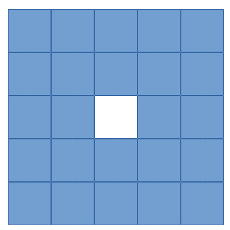

Algorithm info
===============

This page describes some details on the algorithms. Mainly the image reconstruction algorithms and priors, but also on the different subset types. Note that listmode cases apply to any custom detector reconstructions.

Note that https://github.com/villekf/OMEGA/wiki/Function-help#reconstruction-algorithms is also largely valid, though lacks newer algorithms.

.. contents:: Table of Contents

Subset types
------------

There are total of 12 different ways to select subsets. Note that these apply only in the case that you use subsets. These are numbered from 0 to 11. In general, types 1-7 are more suitable for PET and 8-11 for CT and SPECT. 
Below is a short description for each and when to use each:

Type 0
^^^^^^

Type 0 is intended only for custom detector reconstructions, i.e. listmode cases. If you input your own source-detector coordinates or use the index-based reconstruction, then this is a viable subset method. 
Type 0 divides the data into NumberOfSubsets segments. For example, if you have 100 measurements and 4 subsets, the first subset will have measurements 1-25 (one-based indexing), next (26-50), third (51-75) and the last (76-100).
This is useful if the measurement data is already "unordered" such as with listmode data. If, however, your data is ordered, i.e. for example the first 300 measurements are from ring 1, next 300 from ring 2, etc., then this method
is not recommended.

Type 1
^^^^^^

Type 1 divides the measurements by taking every Nth column measurement, i.e. if you have a 2D sinogram of size 10x20 and you use four subsets, then the first one will have measurements 1, 5, and 9 from the first column, 1, 5, and 9 from the
second column, etc. Second subset will have measurements 2, 6, and 10 from the first column, 2, 6, and 10 from the second column, etc. The third subset measurements 3, 7 from the first column, 3, and 7 from the second column, etc. 
While 2D or 3D shape is assumed, this works for 1D inputs as well, i.e. listmode data. With 1D cases, it is assumed that only one column exists. Note that the order is always identical with each column.

Type 2
^^^^^^

Same as above, but for every Nth row measurement. Unlike above, this requires 2D or 3D input to work. This type is not recommended! Does not work with listmode data.

Type 3
^^^^^^

Selects the subsets randomly. Type 3 will randomly select the measurements for each subset. Works for all data types, but can be slower than any other subset type. Not recommended for CT. Works for listmode data as well.

Each subset has unique measurements and as such there are no repetitions.

Type 4
^^^^^^

Takes every Nth column. Type 4 requires 2D or 3D data and is similar to type 1, but rather than taking every Nth measurement along each column, type 4 takes all the measurements along the column. If you want to use measurement-based
filtering with PET data, this method is recommended. It is also in general as good choice as type 1 for PET data. Does not support listmode data.

Type 5
^^^^^^

Same as above but for rows. Not recommended method!

Type 6
^^^^^^

Uses N number of angles to form each subset. First the LORs are sorted according to the angle they create with the (positive) x-axis. Then n_angles angles are grouped together to form one subset. E.g. if n_angles = 2 then 
angles 0 and 1 form one subset, 2 and 3 another, etc. For 2D slices there will be a total of 180°/nangles subsets and 360°/nangles for 3D. 

This method is not recommended!

This method is based on: https://doi.org/10.1088/0031-9155/55/10/009

Type 7
^^^^^^

Uses golden angle sampling to select the subsets. Each sinogram uses the same number of angles and the same angles, the golden angle sampling is thus performed on single sinogram basis. The next angle is selected such that the 
difference is roughly the same as the golden angle (approx. 111.246°). Currently this subset sampling is supported only by sinogram data.

Based on: https://doi.org/10.1109/NSSMIC.2004.1466745

Type 8
^^^^^^

Type 8, and all the ones later, operate on full sinograms/projection images. Type 8 selects every Nth sinogram/projection for each subset. As such, this is mainly recommended for CT and SPECT. For PET, this method can be unreliable.

Listmode reconstruction is not supported.

Type 9
^^^^^^

Selects the sinograms/projections randomly to each subset. Each subset has unique sinograms/projections. Mainly recommended for CT and SPECT. For PET, this method can be unreliable. Listmode reconstruction is not supported.

Type 10
^^^^^^^

Similar to type 7 that type 10 uses golden angle based selection. However, this time full projection images are used. As such this only works for CT and SPECT and is also recommended mainly for 360 degree scans, though 180 should work
too. Does not work with PET data. Listmode reconstruction is not supported.

Type 11
^^^^^^^

Uses prime factor sampling to select the projections/sinograms. Mainly recommended for CT and SPECT. For PET, this method can be unreliable. Listmode reconstruction is not supported.

Based on: https://doi.org/10.1109/42.241889

Stochastic subset selection
^^^^^^^^^^^^^^^^^^^^^^^^^^^

By default the subsets are always used in the same order. However, it is now possible to also select the subsets randomly though it is not completely randomly. The subsets are considered as "groups" that contain a set amount of
measurements, projections, or sinograms. The contents of these groups remain the same even if you use the stochastic subset selection, but the groups themselves are picked randomly. For example, if we have three subsets and 9 measurements,
the subset 1 always contains the same three measurement, such as 1, 4, and 7. However, instead of using first subset 1, then subset 2, and lastly subset 3, any subset can be used first, second, etc.

You can enable the stochastic subset selection by setting ``options.stochasticSubsetSelection = true`` (or ``True`` in Python). Default is false.

Reconstruction algorithms
-------------------------

There are mainly two different types of algorithms: Poisson-based and least-squares based. Both also have variations that enable regularization. Below is a list of the algorithms and whether they are supported by specific 
modality. EM refers to emission tomography as many Poisson-based algorithms have different variations for EM and transmission tomography. For transmission tomography versions, see the technical document (soon to be published).

| Recommended algorithms when regularization is not used (PET and SPECT): OSEM, PKMA, PDHG, PDHGKL
| Recommended algorithms with regularization (PET and SPECT): PKMA, PDHG, PDHGKL
| Recommended algorithms for listmode PET: OSEM, PKMA, PDHG
| Recommended algorithms when regularization is not used (CT): LSQR, CGLS, PDHG
| Recommended algorithms with regularization (CT): PDHG, PKMA

When in doubt, use PDHG, possibly with measurement-based filtering preconditioner.

FDK/FBP
^^^^^^^

Simple filtered backprojection. Scaling is currently incorrect for PET and SPECT data (CT should be fine) and as such the numerical values are not comparable to iterative methods. However, the image itself looks fine. GPU-based algorithm only. Useful for testing purposes as
it is a very fast method. Also useful for very high-dimensional µCT data.

MLEM/OSEM
^^^^^^^^^

While only OSEM is selectable, MLEM is enabled if no subsets are used. This method can be used for PET, SPECT or CT data, or any other Poisson-based data. Note that CT uses its own transmission tomography based formula, while
PET and SPECT use the linear model. Useful algorithm for PET and SPECT, but not particularly recommended for CT. Use OSL_OSEM for regularized version (see below).

| Emission tomography (ET) MLEM based on:  https://doi.org/10.1111/j.2517-6161.1977.tb01600.x
| ET OSEM: https://doi.org/10.1109/42.363108

RAMLA
^^^^^

Similar to OSEM, but has guaranteed convergence and is dependent on the relaxation parameter ``options.lambda`` (or ``options.lambdaN`` in Python), see RELAXATION PARAMETER in the examples. 
Slower to converge than OSEM. Can be used with or without subsets. Note that the default lambda values might not work with RAMLA. The default relaxation parameters are computed if the number of relaxation parameters doesn't equal
the number of iterations, if the variable is omitted or if it's zero. If you wish to enter your own relaxation parameters, make sure that the number of relaxation values equals the number of iterations! 
Not recommended for CT but has transmission tomography based version implemented. See BSREM for regularized version.

ET version based on: https://doi.org/10.1109/42.538946

MRAMLA
^^^^^^

Unregularized version of the MBSREM. Almost identical to `RAMLA <https://omega-doc.readthedocs.io/en/latest/algorithms.html#ramla>`_, i.e. requires lambda (see above), but supports preconditioners. EM preconditioner is also highly recommended! Has some additional steps to guarantee convergence. 
Also has dedicated transmission tomography version. Useful for any Poisson-based data, if regularization is not used. The upper bound (see the article) can be optionally set with ``options.U``, if zero, a default value is computed.

ET version based on: https://doi.org/10.1109/TMI.2003.812251

ROSEM
^^^^^

Identical to OSEM except that includes relaxation (lambda, see `RAMLA <https://omega-doc.readthedocs.io/en/latest/algorithms.html#ramla>`_ above) as well. Useful for testing/comparison purposes only. See ROSEM-MAP for regularized version.

RBI
^^^

Subset-based algorithm similar to OSEM. Convergence is not guaranteed. No transmission tomography version. Useful for testing/comparison purposes only. See OSL-RBI for regularized version.

Based on: https://doi.org/10.1109/83.499919

DRAMA
^^^^^

Modified version of `RAMLA <https://omega-doc.readthedocs.io/en/latest/algorithms.html#ramla>`_. Requires some additional parameter tuning (see DRAMA PROPERTIES in the examples and the original article for details on the parameters), but can provide faster convergence. No transmission tomography version. 
No regularized version available.

Based on: https://doi.org/10.1088/0031-9155/48/10/312

COSEM
^^^^^

Unlike OSEM, has guaranteed convergence but is much slower to converge. No transmission tomography version. It is recommended to use ECOSEM or ACOSEM instead. Regularized version available with OSL-COSEM.

Based on: https://doi.org/10.1117/12.467144

ECOSEM
^^^^^^

Uses both `OSEM <https://omega-doc.readthedocs.io/en/latest/algorithms.html#mlem-osem>`_ and `COSEM <https://omega-doc.readthedocs.io/en/latest/algorithms.html#cosem>`_ to compute a converged version. Faster than regular COSEM. ACOSEM probably provides faster convergence. No transmission tomography version. Note that the "weighting" between COSEM and OSEM is identical to that
of the original article!

Based on: https://doi.org/10.1088/0031-9155/49/11/002

ACOSEM
^^^^^^

Accelerated version of `COSEM <https://omega-doc.readthedocs.io/en/latest/algorithms.html#cosem>`_. No transmission tomography version. Useful for non-regularized PET/SPECT reconstructions if converge is required. Regularized version available with OSL-COSEM. Requires the acceleration parameter, see
ACOSEM PROPERTIES in the examples. The acceleration parameter is defined by ``options.h`` where 2 is the default value.

Based on: https://doi.org/10.1088/0031-9155/55/3/003

FISTA
^^^^^

Least-squares based algorithm. Can be used for any data and with or without subsets. Supports preconditioners. Does not support regularization at the moment (except the below one). Requires the computation of the Lipschitz
constant for the system. This is computed automatically if ``options.tauCP`` is omitted or zero, but a precomputed value can be input as well in which case the precomputation is omitted (this speeds up the reconstruction).
See PDHG PROPERTIES in the examples (the ``tauCP``-values affect FISTA as well, this includes ``tauCPFilt`` if the filtering-based preconditioner is used).

Based on: https://doi.org/10.1137/080716542

FISTAL1
^^^^^^^

FISTA with built-in L1 regularization. Otherwise identical to FISTA. Use ``options.beta`` as the regularization parameter.

Based on: https://doi.org/10.1007/s10878-019-00453-7

LSQR
^^^^

Least-squares based algorithm. Does not support subsets! Can be used for any data. Does not support regularization. Potentially useful test algorithm for CT data.

Based on: https://doi.org/10.1145/355984.355989

CGLS
^^^^

Least-squares based algorithm. Does not support subsets! Can be used for any data. Does not support regularization. Potentially useful test algorithm for CT data.

Based on: https://doi.org/10.6028/jres.049.044

SART
^^^^

Can be used with or without subsets. Uses same relaxation parameter as all the other algorithms using relaxation (i.e. ``options.lambda`` or ``options.lambdaN``,see `RAMLA <https://omega-doc.readthedocs.io/en/latest/algorithms.html#ramla>`_ above for some details). 
None of the examples currently include this algorithm, but you can enable it with ``options.SART = true`` in MATLAB/Octave and ``options.SART = True`` in Python. 
Supports regularization. Potentially useful test algorithm for CT data. Implementation 2 only! Use ``options.beta`` as the regularization parameter.

Based on: https://doi.org/10.1016/0161-7346(84)90008-7 and https://content.iospress.com/articles/journal-of-x-ray-science-and-technology/xst00110 and https://doi.org/10.1137/S089547980138705X

OSL-OSEM
^^^^^^^^

OSL version of OSEM. Otherwise identical to OSEM but allows the use of regularization. MLEM version can be enabled by using only 1 subset. Everything that applies to OSEM/MLEM, applies here. 
Use ``options.beta`` as the regularization parameter.

OSL based on: https://doi.org/10.1109/42.52985

MBSREM
^^^^^^

Regularized version of `MRAMLA <https://omega-doc.readthedocs.io/en/latest/algorithms.html#mramla>`_. Requires relaxation parameter lambda (see `RAMLA <https://omega-doc.readthedocs.io/en/latest/algorithms.html#ramla>`_ for details), and supports preconditioners. EM preconditioner is also highly recommended! Has some additional steps to guarantee convergence. 
Also has dedicated transmission tomography version. Useful for any Poisson-based data, if regularization is used. Use ``options.beta`` as the regularization parameter.

ET version based on: https://doi.org/10.1109/TMI.2003.812251

BSREM
^^^^^

Regularized version of `RAMLA <https://omega-doc.readthedocs.io/en/latest/algorithms.html#ramla>`_. However, unlike MBSREM, BSREM handles the regularization differently. While MBSREM computes the regularization after every subset, BSREM does it only after one full iteration (epoch). This can
sometimes be useful as less regularization steps might be used. Requires relaxation parameter lambda. Also has dedicated transmission tomography version. Use ``options.beta`` as the regularization parameter.

ET version based on: https://doi.org/10.1109/42.921477

ROSEM-MAP
^^^^^^^^^

Regularized version of `ROSEM <https://omega-doc.readthedocs.io/en/latest/algorithms.html#rosem>`_. Also like BSREM, this performs regularization at full iteration (epoch) level. Requires relaxation parameter lambda (see `RAMLA <https://omega-doc.readthedocs.io/en/latest/algorithms.html#ramla>`_ for details). Also has dedicated transmission tomography version. 
Use ``options.beta`` as the regularization parameter.

OSL-RBI
^^^^^^^

Regularized version of `RBI <https://omega-doc.readthedocs.io/en/latest/algorithms.html#rbi>`_. Otherwise identical. No transmission tomography version. Use ``options.beta`` as the regularization parameter.

OSL-COSEM
^^^^^^^^^

Regularized version of either `COSEM <https://omega-doc.readthedocs.io/en/latest/algorithms.html#cosem>`_ or `ACOSEM <https://omega-doc.readthedocs.io/en/latest/algorithms.html#acosem>`_. If ``options.OSL_COSEM = 1`` then OSL-ACOSEM is used. With ``options.OSL_COSEM = 2`` OSL-COSEM is used. ECOSEM is not supported. 
Functions otherwise the same as their parent algorithms, so see those for some more details. No support for transmission tomography. Use ``options.beta`` as the regularization parameter.

PKMA
^^^^

Similar to `MBSREM <https://omega-doc.readthedocs.io/en/latest/algorithms.html#mbsrem>`_. Can be used without regularization but also supports regularization. Supports also proximal priors (TV and TGV). Supports preconditioners. Transmission tomography support. Requires the relaxation parameter lambda, 
see RELAXATION PARAMETER in the examples and `RAMLA <https://omega-doc.readthedocs.io/en/latest/algorithms.html#ramla>`_ above. 
Useful for any Poisson-based data, if regularization is used. Useful also without regularization. The recommended algorithm for Poisson-based reconstructions. Unlike MBSREM, also requires the momentum parameter, see PKMA PROPERTIES in the examples.
The momentum parameter is defined in ``options.alpha_PKMA`` and if left zero or empty, it is computed automatically. You can instead input your own values, but make sure that the number of elements equals number of subsets * number of iterations!
If the values are computed automatically, these values can be adjusted with ``options.rho_PKMA`` and ``options.delta_PKMA``. The automatic formula is (``options.subsets`` is the number of subsets):

.. code-block:: matlab
   oo = 1;
   for kk = 1 : options.Niter
      for ll = 0 : options.subsets - 1
         options.alpha_PKMA(oo) = 1 + (options.rho_PKMA *((kk - 1) * options.subsets + ll)) / ((kk - 1) * options.subsets + ll + options.delta_PKMA);
         oo = oo + 1;
      end
   end

Note that for PET and SPECT data the relaxation parameter can safely begin at 1, but for CT data this is not the case. Due to this, PKMA is a bit difficult algorithm for CT data as you might need to manually adjust the relaxation parameter
until it is of the right magnitude. Too high values will cause quick divergence while too low values will cause slow convergence. For CT, the default value of 1 is divided by 10000 (when you use default values). This should work for
most CT applications, but it might not be optimal. To fix this, a proper normalization would be required for the backprojection (suggestions are welcome!).

ET version based on: https://doi.org/10.1109/TMI.2019.2898271

PDHG
^^^^

PDHG refers to the L2 norm least-squares PDHG. Supports subsets, linear models, regularization and preconditioners. Useful for any data. Measurement-based preconditioners are guaranteed to work unlike with PKMA or MBSREM.
By default, the primal and dual step-sizes are computed automatically, you can, however, input manual values too, see PDHG PROPERTIES in the examples. Supports also adaptive step-size computations, but it is not recomended with multi-resolution
reconstruction. Supports both proximal priors as well as regular non-linear convex ones (in the latter case it is actually the Condat-Vu algorithm).
The primal value is set with ``options.tauCP``, but is computed automatically if empty or zero. If using a filtering-based preconditioner, a specific primal value is set with ``options.tauCPFilt``, and like the previous one, is computed automatically
if zero or empty. Dual value is set with ``options.sigmaCP``, but 1 can be safely used. Update step-size is set with ``options.thetaCP``, but can also be safely set as 1. 

The primal and dual variables can also be updated adaptively by setting ``options.PDAdaptiveType`` to either 1 or 2. Note that 1 corresponds to rule B from the article and 2 to rule A. See the article for details.

| Based on: https://doi.org/10.1007/s10851-010-0251-1
| Adaptive methods based on: https://doi.org/10.1007/s10851-024-01174-1

CV
^^

Exactly the same as above PDHG, but for convex gradient-based priors.

| Based on: https://doi.org/10.1007/s10957-012-0245-9 and https://doi.org/10.1007/s10444-011-9254-8

PDHGL1
^^^^^^

Same as above but L1 norm. Has exactly the same properties as the L2 norm version.

Based on: https://doi.org/10.1088/0031-9155/57/10/3065

PDHGKL
^^^^^^

Same as above but for Kullback-Leibler divergence. This is useful only for linear Poisson-based data, e.g. PET or SPECT. Otherwise has the same properties as the L2 norm one.

Based on: https://doi.org/10.1088/0031-9155/57/10/3065

PDDY
^^^^

Variation of `PDHG <https://omega-doc.readthedocs.io/en/latest/algorithms.html#pdhg>`_ L2 norm version. Is not as strict with the requirements for primal and dual step-sizes with non-linear regularizers. Recommended only if PDHG fails with some specific prior, but that should not happen with
built-in priors. Slightly slower than PDHG but otherwise everything is identical.

Based on: https://doi.org/10.1007/s10957-022-02061-8

ASD-POCS
^^^^^^^^

Currently not included in any of the examples, but you can enable it with ``options.ASD_POCS = true`` (MATLAB/Octave) or ``options.ASD_POCS = True`` (Python). Adjustable parameters are ``options.POCS_NgradIter`` 
(number of iterations for the denoising phase), ``options.POCS_alpha``, ``options.POCS_rMax``, ``options.POCS_alphaRed`` and ``options.POCSepps``. Note that ``options.POCSepps`` is the epsilon value in the original article.
All values have default values which are taken from the original article, except for epsilon value which is 1e-4. Supports subsets, but doesn't support any preconditioners. Note that, like `SART <https://omega-doc.readthedocs.io/en/latest/algorithms.html#sart>`_, this algorithm requires 
the relaxation parameters ``options.lambda`` (MATLAB/Octave) or ``options.lambdaN`` (Python), see `RAMLA <https://omega-doc.readthedocs.io/en/latest/algorithms.html#ramla>`_. You can use the default value(s) or input your own values. Implementation 2 only!

Unlike the original article, any non-proximal prior can be used here, though the functionality cannot be guaranteed!

Does not support projector type 6 at the moment.

Based on: http://dx.doi.org/10.1088/0031-9155/53/17/021

SAGA
^^^^

Only included in the full examples, but can be enabled with ``options.SAGA = true`` (MATLAB/Octave) or ``options.SAGA = True`` (Python). Supports gradient-based regularization. Implementation 2 only! Supports both emission and transmission tomography.

Based on: https://arxiv.org/abs/1407.0202

FISTA acceleration
^^^^^^^^^^^^^^^^^^

Not an algorithm but rather an acceleration method for algorithms. You can enable it with ``options.FISTA_acceleration = true``  (MATLAB/Octave) or ``options.FISTA_acceleration = True`` (Python). Can help with convergence speed
but can also cause artifacts in the reconstructions. Quality might be algorithm dependent.

Based on: https://doi.org/10.1016/j.ultramic.2018.03.022

Priors
----------

Many of the priors are dependent on the neighborhood size, i.e. the number of neighboring voxels that are taken into account during regularization. This can be selected for all three dimensions (X/Y/Z) though at the moment
X and Y should be identical (transaxial dimensions). For example ``options.Ndx = 1``, ``options.Ndy = 1``, ``options.Ndz = 0`` selects all the 8 neighboring transaxial voxels, while with ``options.Ndz = 1`` a total of 27 voxels would
be included, and so on. The larger the neighborhood, the longer the computation time. If a prior is NOT affected by this, it is specifically mentioned.

Below is another example of the neighborhood. In the below (2D) example we have ``options.Ndx = 2`` and ``options.Ndy = 2``, with the center pixel in white and neighborhood as blue. Note that the NLM patch region works the same way.

   Example neighborhood with ``options.Ndx = 2`` and ``options.Ndy = 2``.

Quadratic
^^^^^^^^^

Simple quadratic prior. Define the weights at QP PROPERTIES. By default, the distance from the center voxel is used as the weight, with the sum of all weights normalized to one. Custom weights can be input. 
The weights vector should be of size (Ndx*2+1) * (Ndy*2+1) * (Ndz*2+1) and the middle value inf.

Huber prior
^^^^^^^^^^^

Similar to quadratic prior, but can prevent large variations and thus artifacts happening by limiting the values. See HP PROPERTIES for the parameter.

Based on: https://doi.org/10.1002/9780470434697

MRP
^^^

Median root prior. By default, the prior uses normalization. Disabling this normalization, however, can lead to improvement in image quality. You can turn the normalization off with ``options.med_no_norm = true``. Can be useful prior
with PET or SPECT data.

Based on: https://doi.org/10.1007/BF01728761

L-filter
^^^^^^^^

Custom weights can be input, see L-FILTER PROPERTIES. The weights vector should be of size (Ndx*2+1) * (Ndy*2+1) * (Ndz*2+1) (middle value is NOT inf).

If custom weights are not given, the ``options.oneD_weights`` determines whether 1D (true) or 2D (false) weighting scheme is used. In 1D case, if (Ndx*2+1) * (Ndy*2+1) * (Ndz*2+1) = 3, = 9 or = 25 then the weights are exactly as 
in literature. Otherwise the pattern follows a Laplace distribution. In 2D case, the weights follow Laplace distribution, but are also weighted based on the distance of the neighboring voxel from the center voxel. 
For Laplace distribution, the mean value is set to 0 and b = 1/sqrt(2). The weights are normalized such that the sum equals 1.

Based on: https://doi.org/10.1109/NSSMIC.2000.950105

FMH
^^^

Custom weights can be input, see FMH PROPERTIES. The weights vector should be of size [Ndx*2+1, 4] if Nz = 1 or Ndz = 0 or [Ndx*2+1, 13] otherwise. The weight for the center pixel should also be the middle value when the weight matrix is in vector form. 
The weights are normalized such that the sum equals 1.

If custom weights are not provided, then the ``options.fmh_center_weight`` parameter is needed. Default value is 4 as in the original article.

Based on: https://doi.org/10.1109/NSSMIC.2000.950105

Weighted mean
^^^^^^^^^^^^^

The mean type can be selected to be arithmetic mean, harmonic mean or geometric mean. See WEIGHTED MEAN PROPERTIES.

Custom weights can be input. The weights vector should be of size (Ndx*2+1) * (Ndy*2+1) * (Ndz*2+1).

If custom weights are not provided, then the options.weighted_center_weight parameter is needed. Default value is 4.

Based on: https://doi.org/10.1109/42.61759 and https://doi.org/10.1109/TMI.2002.806415

TV
^^

TV is not affected by the neighborhood size.

TV is "special" since it actually contains several different variations. See TV PROPERTIES for the parameters. Note that for proximal TV, see Proximal TV. This is the gradient-based TV.

First is the "TV type", ``options.TVtype``. Types 1 and 2 are identical if no anatomical weighting is used. Type 3 is the hyperbolic prior if no anatomical weighting is used. Type 6 is a weighted TV prior. TV type 4 is the Lange prior.

| A complete list and explanation of the TV types:
| Type 1: Regular isotropic TV if no anatomical weighting is used. Based on: https://doi.org/10.1007/s10851-017-0749-x
| Type 2: Regular isotropic TV if no anatomical weighting is used. Based on: https://doi.org/10.1109/TMI.2016
| Type 3: Hyperbolic prior if no anatomical weighting is used, use hyperbolic prior instead in such cases. Type 3 is not recommended! Based on: https://doi.org/10.1088/0031-9155/60/6/2145
| Type 4: Modified Lange prior. Does not support anatomical weighting. Based on: https://doi.org/10.1109/TMI.2019.2898271 and https://doi.org/10.1109/42.61759
| Type 5: N/A
| Type 6: Weighted TV. Does not support anatomical weighting. Based on: https://doi.org/10.1088/0031-9155/57/23/7923

Since this applies to the "gradient"-based TV, the smoothing term can be adjusted (``options.TVsmoothing``). This smoothing term should not be zero as it prevents division by zero. Larger values lead to smoother images.

Anatomical weighting can be enabled with ``options.TV_use_anatomical``. Reference image can be either a mat-file or a variable. In the former case, input the name and path to ``options.TV_reference_image``, otherwise the variable.
If a mat-file is used, the reference image should be the only variable.

``options.T`` is the edge threshold parameter in type 1, scale parameter for side information in type 2 and weight parameter for anatomical information in type 3.

``options.C`` is the weight of the original image in type 3.

``options.SATVPhi`` is the adjustable parameter of type 4 (Lange) or the strength of the weighting in type 6.

In the future, Lange will probably be transformed into a separate prior. 

Recommended ones are types 1 or 4.

Proximal TV
^^^^^^^^^^^

Proximal TV is not affected by the neighborhood size.

The proximal mapping version of TV. There are no adjustable parameters and this only works with algorithms that support proximal methods (PKMA and PDHG and its variants).

Mathematically more correct version of TV.

Anisotropic Diffusion Median Root Prior
^^^^^^^^^^^^^^^^^^^^^^^^^^^^^^^^^^^^^^^

In general this prior is not recommended and is included merely for historical and experimental purposes.

It functions same as median root prior, except that rather than use median filtered image, it uses anisotropic diffusion filtered image.

All the adjustable parameters are from: https://arrayfire.org/docs/group__image__func__anisotropic__diffusion.htm

APLS
^^^^

Based on: https://doi.org/10.1109/TMI.2016

Using asymmetric parallel level sets requires the use of anatomic prior. Without anatomical prior it functions as TV types 1 and 2.

Regularization parameters for all MAP-methods can be adjusted.

``options.eta`` is a scaling parameter in regularized norm (see variable η in the reference).

``options.APLSsmoothing`` is a "smoothing" parameter that also prevents zero in square root (it is summed to the square root values). Has the same function as the TVsmoothing parameter (see eq. 9 in the reference).

``options.APLS_reference_image`` is the reference image itself OR name of the file containing the anatomical reference images (image size needs to be the same as the reconstructed images). The reference images need to be the only variable in the file.

Hyperbolic prior
^^^^^^^^^^^^^^^^

Based on: https://doi.org/10.1109/83.551699 and https://doi.org/10.1088/0031-9155/60/6/2145

Modified hyperbolic prior, previously exclusively used as TV type 3. Unlike TV type 3, doesn't support anatomic weighting.

``options.hyperbolicDelta`` can be used to adjust the edge emphasing strength.

TGV
^^^

TGV is not affected by the neighborhood size.

Based on: https://doi.org/10.1137/090769521

Recommended only for proximal supporting methods (PDHG and its variants, PKMA).

``options.alpha0TGV`` is the first weighting value for the TGV (see parameter α1 in the reference).

``options.alpha1TGV`` is the second weighting value for the TGV (see parameter α0 in the reference). Weight for the symmetrized derivative.

RDP
^^^

Based on: https://doi.org/10.1109/TNS.2002.998681

RDP can be a bit confusing prior as there are 2/3 different ways it is computed. First of all, implementation 2 is highly recommended for RDP in MATLAB/Octave (Python only supports implementation 2). Second, with implementation 2
it is recommended to use the OpenCL or CUDA versions and not the CPU version.

RDP with implementation 2 (OpenCL + CUDA) has two different methods. The default is similar to the original RDP, i.e. only the voxels next to the current voxel are taken into account (voxels that share a side with the current voxel). 
This means that ``options.Ndx/y/z`` are not used with the default method. 
Second method is enabled by setting ``options.RDPIncludeCorners = true`` (``options.RDPIncludeCorners = True`` for Python). This changes the functionality of the RDP significantly. First of all, the neighborhood size affects RDP
as well, i.e. the parameters ``options.Ndx/y/z``. This second version thus uses square/rectangular/cubic neigborhoods. Second, same weights are used as with quadratic prior, i.e. distance-based weights. You can input your own weights into ``options.weights`` or use the distance-based weights (the distance from the current voxel to
the neigborhood voxel) which is the default option. The default version (i.e. when ``options.RDPIncludeCorners = false``) does not use any weighting. Lastly, this second version supports a "reference image" weighting, based on: https://dx.doi.org/10.1109/TMI.2019.2913889. 
To enable you need to additionally set ``options.RDP_use_anatomical`` and provide the reference image either as mat-file in ``options.RDP_reference_image`` (MATLAB/Octave) or ``options.RDP_referenceImage`` (Python) or as a vector. 
You need to manually compute the reference image. The reference image weighting itself is computed automatically, i.e. the kappa values.

When using RDP with implementation 2 and CPU, the functionality is the same as the first, default, method. Second method is not available.

When using other implementations, the functionality is closer to the second method. However, no reference image weighting is supported.

In all cases, the edge weight can be adjusted with ``options.RDP_gamma``.

GGMRF
^^^^^

Based on: https://doi.org/10.1118/1.2789499

The original article includes adjustable parameters `p`, `q` and `c` which can be adjusted with ``options.GGMRF_p``, ``options.GGMRF_q``, and ``options.GGMRF_c``, respectively.

NLM
^^^

Based on: https://doi.org/10.1137/040616024

``options.sigma`` is the filtering parameter/strength.

The patch region is controlled with parameters ``options.Nlx``, ``options.Nly`` and ``options.Nlz``. The similarity is investigated in this area and the area is formed just like the neighborhood.

The strength of the Gaussian weighting (standard deviation) can be adjusted with ``options.NLM_gauss``.

If ``options.NLM_use_anatomical = true`` then an anatomical reference image is used in the similarity search of the neighborhood. Normally the original image is used for this. `options.NLM_reference_image` is either the reference image itself OR is the name of the anatomical reference data file. The reference images need to be the only variable in the file.

NLM, by default, uses the original NLM, but it can also use other potential functions in a non-local fashion. Setting any of the below ones to true, uses the corresponding method. Note that from below options, select only one! All
other NLM options affect the below selections as well.

If you wish to use non-local total variation, set ``options.NLTV = true``. 

NLM can also be used like MRP (and MRP-AD) where the median filtered image is replaced with NLM filtered image. This is achieved by setting ``options.NLM_MRP = true``. This is computed without normalization ((λ - MNLM)/1).

Non-local relative difference prior can se selected with ``options.NLRD = true``. Note that ``options.RDP_gamma`` affects NLRD as well.

Non-local generalized Gaussian Markov random field prior can be selected with ``options.NLGGMRF = true``. As with RDP, the `p`, `q`, and `c` parameters affect this prior as well.

Non-local Lange function is enabled with ``options.NLLange``. ``options.SATVPhi`` is the tuning parameter for the Lange function.

All the non-local methods also support an "adaptive" non-local weighting. This is enabled with ``options.NLAdaptive`` and is based on http://dx.doi.org/10.1016/j.compmedimag.2015.02.008. Note that the filter parameter (``options.sigma``)
is the s value from the paper, while the t value is adjusted with ``options.NLAdaptiveConstant``.

Preconditioners
===============

Image-based preconditioners
---------------------------

Diagonal preconditioner
^^^^^^^^^^^^^^^^^^^^^^^

The diagonal preconditioner is simply the inverse of image-based sensitivity image, i.e. ``1/(A^T1)``.

EM preconditioner
^^^^^^^^^^^^^^^^^

Similar to above, but the previous estimate ``f`` is included as well ``f/(A^T1)``.

IEM preconditioner
^^^^^^^^^^^^^^^^^^

Based on: https://doi.org/10.1109/TMI.2019.2898271

Similar to above, but a reference image is needed: ``max(f, fRef, epsilon)/(A^T1)``. epsilon is a small value to prevent too small values. You need to input the reference image beforehand to ``options.referenceImage``. 

Momentum-like preconditioner
^^^^^^^^^^^^^^^^^^^^^^^^^^^^

Essentially a subset-based relaxation. Based on: https://doi.org/10.1109/TMI.2022.3181813

You can input the momentum parameters with ``options.alphaPrecond`` or let OMEGA compute parameters with same logic as with PKMA by inputting ``options.rhoPrecond`` and ``options.delta1Precond``. If these values are omitted, the PKMA variables are used
instead.

Gradient-based preconditioner
^^^^^^^^^^^^^^^^^^^^^^^^^^^^^

Uses weighted gradient of the current estimate as a preconditioner. Based on: https://doi.org/10.1109/TMI.2022.3181813

You need to specify the iteration were the preconditioner is first computed with ``options.gradInitIter``. It is not recommended to use the first iteration due to blurry estimate. Then you need to specify the last iteration
where the gradient is computed with ``options.gradLastIter``. The gradient is no longer computed after this iteration, but the last computed gradient is still used in all the remaining iterations.

You also need to specify the lower and upper bound values with ``options.gradV1`` and ``options.gradV2``. See the paper for details.

Can improve convergence if properly configured, but can be difficult and time-consuming to get working properly. Also increases the computation time due to the need to compute the gradient of the estimate.

Filtering-based preconditioner
^^^^^^^^^^^^^^^^^^^^^^^^^^^^^^

TBD.

Measurement-based preconditioners
---------------------------------

Diagonal preconditioner
^^^^^^^^^^^^^^^^^^^^^^^

The diagonal preconditioner is simply the inverse of measurement-based sensitivity image, i.e. ``1/(A1)``.

Filtering-based preconditioner
^^^^^^^^^^^^^^^^^^^^^^^^^^^^^^

TBD.