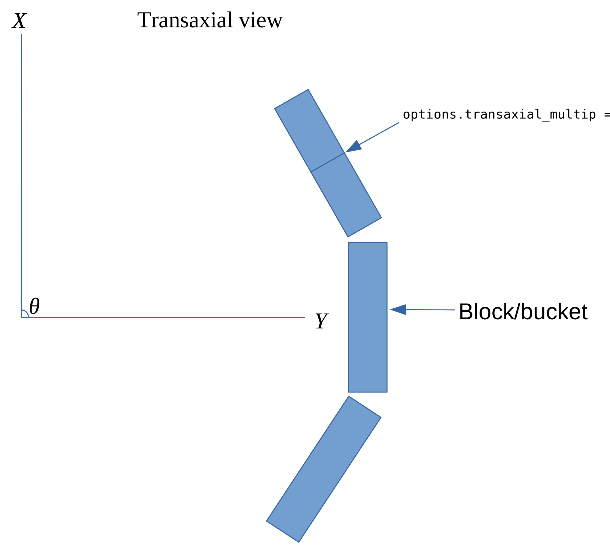
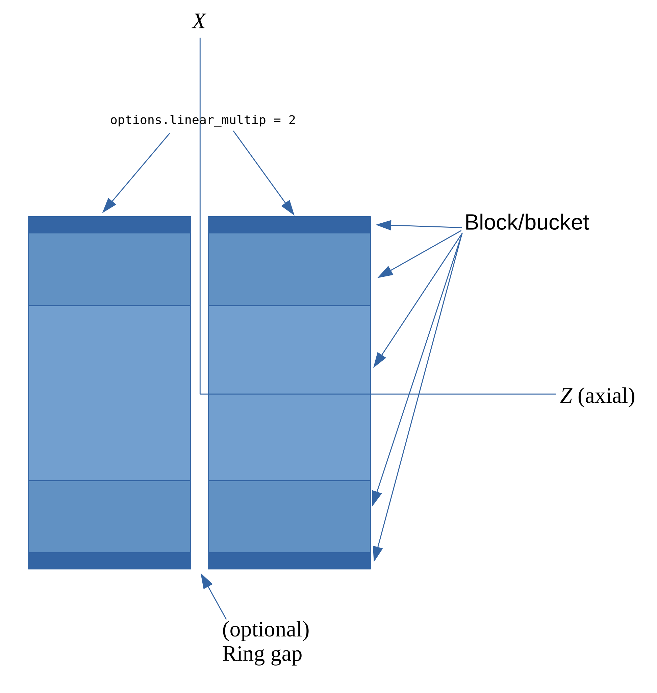
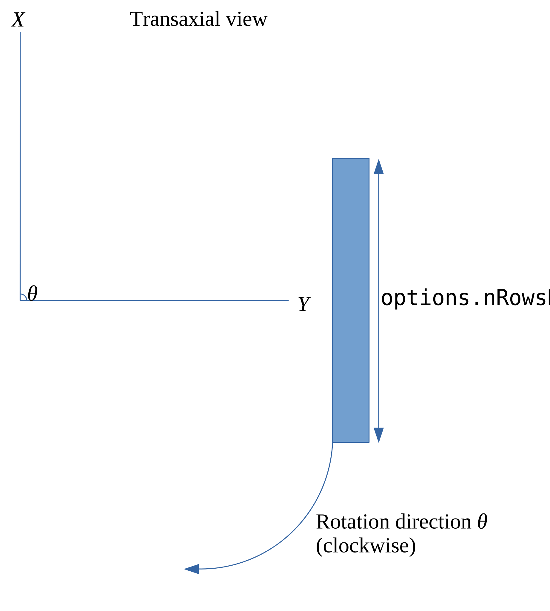
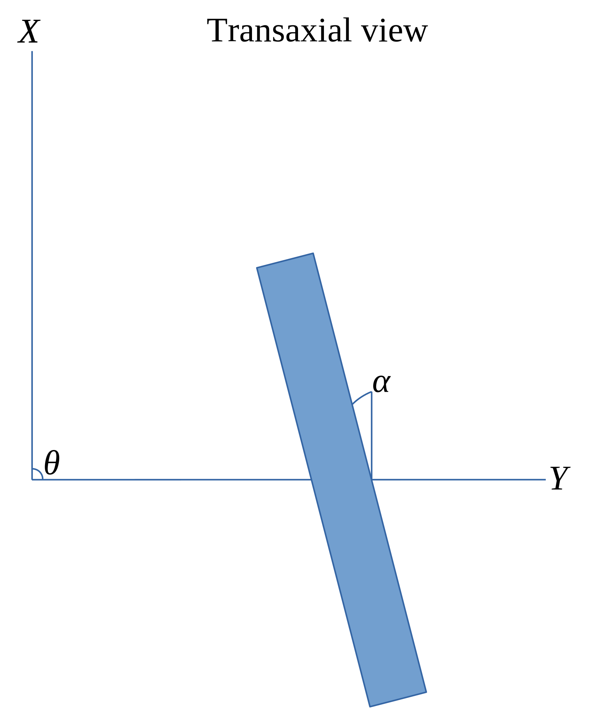
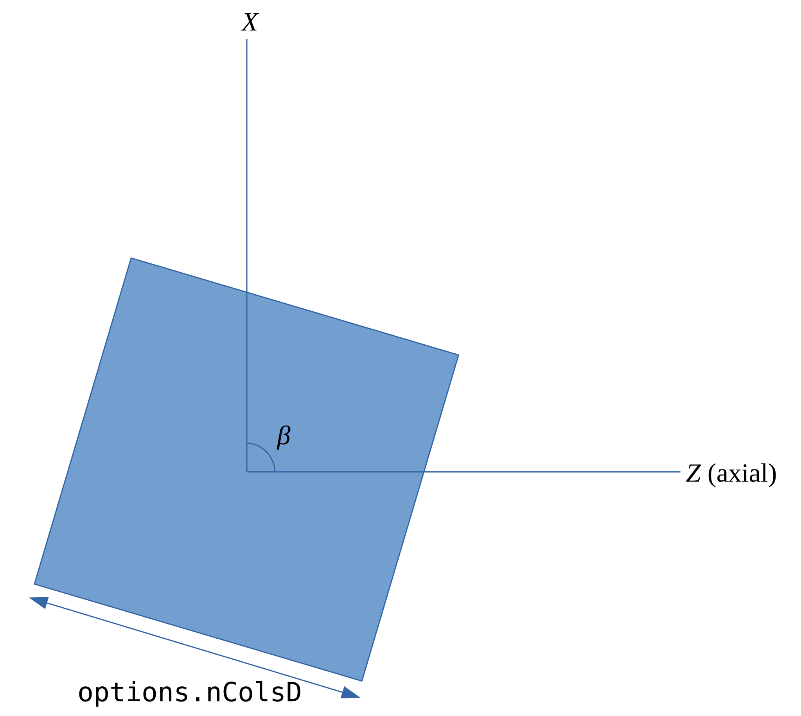

OMEGA geometry
==============

This page outlines the geometry used in OMEGA, with focus on PET, SPECT and CT.

.. contents:: Table of Contents

PET geometry
------------

All the projectors in OMEGA for PET are ray-based. Since in PET we are computing the probabilities, rather than the just lines of intersection, we need the whole length of the ray as well.
By default, the probability is computed by using the whole length of the ray from one detector to the other. However, it is possible to instead compute the probability based on the
length of the ray inside the field-of-view (FOV) only. This can be enabled by setting ``options.useTotLength = false`` (``False`` in Python). 

Transaxial
^^^^^^^^^^

The figure below outlines the geometry of PET in the transaxial (XY) direction. One thing to note is that, if you're using GATE data,
if you have sub-blocks in one block, you'll need set this to ``options.transaxial_multip``. In the figure below, the top right block
has two sub-blocks, but it is still considered as one single block. However, in this case ``options.transaxial_multip = 2``. If you 
don't have sub-blocks, you only need the total number of blocks per ring. Ring means the transaxial view in this. For example, the figure
below has 3 blocks. When inputting your own sinograms, the row axis should have the radial distance and the column axis the angles.
This means that you should get horizontal "sine" curve. For Python, take note that the data needs to use Fortran data ordering, i.e. column 
major ordering.

If you input your own detector coordinates, you don't need to specify these. You can use any geometry you wish, but if the system
doesn't correspond to a cylindrical block-based PET scanner, you'll need to input the detector coordinates manually. The built-in
support for cylindrical PET scanners is simply more efficient than inputting the coordinates manually, when it is applicable. 
Again, there are no restrictions to the geometry if you input your own coordinates.

   PET geometry in the transaxial view.
   
Axial
^^^^^

The figure below outlines the geometry of PET in the axial (XZ) direction. If you have more than one bucket axially, you'll need to specify
``options.linear_multip``. The ``options.cryst_per_block_axial`` multiplied with ``options.linear_multip`` should equal the number of crystal
rings. In the below figure ``options.linear_multip = 2`` and ``options.blocks_per_ring = 8``. If the blocks have gaps between them, you can take
these into account automatically by setting ``options.ringGaps`` such that it contains the crystal rings after which there is a gap. For example, 
if blocks would have ``options.cryst_per_block_axial = 20`` then ``options.ringGaps = 20``.

Again, if you use your own coordinates you only need to input them. None of the above are needed when using custom detector coordinates.

   PET geometry in the axial view.
   

CT/SPECT geometry
-----------------

Transaxial
^^^^^^^^^^

CT and SPECT geometries don't differ from each other. The rotation angle is denoted with θ and the rotation is generally assumed to be clockwise.
What is important is that when you visualize the projection images, the rotation directed downwards. This applies to both MATLAB/Octave and Python.
For Python, take note that the data needs to use Fortran data ordering, i.e. column major ordering. ``options.nRowsD`` should contain the number of 
rows in each projection.

For CT, it is also possible to input your own custom detector coordinates. However, in this case you won't be able to use projector type 5 or the
voxel-based backprojection of projector type 4. This means that aliasing artifacts can appear. In this case, again, you can ignore all parameters
except for FOV size and the number of voxels per axis.

   CT/SPECT geometry in the transaxial view.
   
For CT, it is also possible that the panel is rotated in the transaxial plane with respect to the center of the panel. The figure below outlines 
such a case. You can take this into account by inputting α as the first column of ``options.pitchRoll``. It can be either a scalar or a vector.

   CT/SPECT geometry in the transaxial view with rotation.
   
Axial
^^^^^

Again, CT and SPECT geometries don't differ here except that CT supports panel rotation along the angle β, as outlined in the below figure.
You can include this angle as the second column of ``options.pitchRoll``. Note that, if you have non-zero α but zero β, then the second column
of ``options.pitchRoll`` has to be zeros. Same applies the other way around.

   CT/SPECT geometry in the axial view.
   
Fan beam CT data
^^^^^^^^^^^^^^^^

While OMEGA inherently assumes cone beam data format, fan beam can also be used. When using fan beam data, the input projections should be essentially
1D slices, for example of size numberOfRowsX1XnumberOfProjections (or number of columns, the only thing that is important is that either of these has the
dimension of 1). If the fan beam source moves axially, you can input these as additional projections. The source and center of the 1D slice coordinates 
have to be input for all projections/combinations. Pure 2D reconstruction is not possible as the axial/z-direction has to be defined at all times, but
the axial/z-direction can have only one slice.

Parallel beam CT data
^^^^^^^^^^^^^^^^^^^^^

Parallel beam CT data can also be used, but it requires the input data to be in projection format as with CBCT data. The only difference with parallel
beam is that the source is always assumed to move exactly like the detector pixels. This means that you need to input the coordinates of the center of 
the source and detector panels, and both the source and detector pixels always are always moved identically. This means that when moving from the center
to a corner pixel in the detector panel, the source is also moved the exact same amount. If the center coordinates are exactly perpendicular, the 
resulting coordinates will be perpendicular too. This assumes that the detector pixels/source are always moved as defined by the size of one detector
pixel. If there is variation in the shifts, that cannot be taken into account at the moment, meaning that shifts have to be constant and fixed for each
projection. There can be a difference in the row and/or column directions though.

Use parallel beam setup by setting ``options.useParallelBeam`` to true.
   
   
Any data
--------

Any type of data can also be used, if you input your own custom detector coordinates, or source-detector pairs, depending on the setup. In such a case,
you only need to input the FOV sizes and the number of voxels per axis in the final image. Optionally also the object offsets (for example 
``options.oOffsetX``) if you wish to move the image volume from the origin (the volume is always by default centered on the origin). 
``options.x`` should include the source coordinates for the X, Y and Z directions, and the detector coordinates for X, Y and Z, for EACH measurement. 
This means that a total of 6 coordinates are needed per ONE measurement. For Python, these need to be Fortran-ordered (column major).