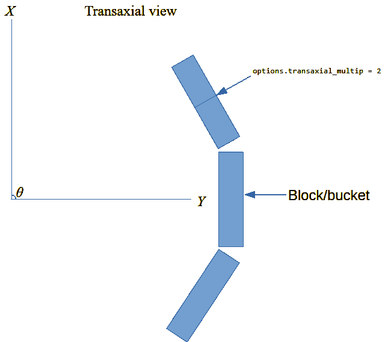

OMEGA geometry
==============

This page outlines the geometry used in OMEGA, with focus on PET, SPECT and CT.

PET geometry
------------

The figure below outlines the geometry of PET in the transaxial (XY) direction. One thing to note is that, if you're using GATE data,
if you have sub-blocks in one block, you'll need set this to ``options.transaxial_multip``. In the figure below, the top right block
has two sub-blocks, but it is still considered as one single block. However, in this case ``options.transaxial_multip = 2``. If you 
don't have sub-blocks, you only need the total number of blocks per ring. Ring means the transaxial view in this. For example, the figure
below has 3 blocks.

If you input your own detector coordinates, you don't need to specify these. You can use any geometry you wish, but if the system
doesn't correspond to a cylindrical block-based PET scanner, you'll need to input the detector coordinates manually. The built-in
support for cylindrical PET scanners is simply more efficient than inputting the coordinates manually, when it is applicable. 
Again, there are no restrictions to the geometry if you input your own coordinates.

   PET geometry in the transaxial view.